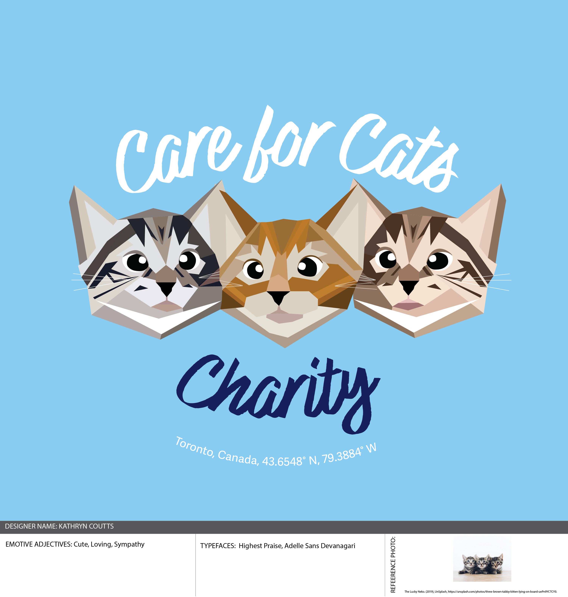

# Kathryn Coutts Resume
[Visit me on LinkedIn](https://www.linkedin.com/in/kathryn-coutts-700370436/)
## About Me
I am a Graphic Design student at Humber Polytechnic. 

## Employment 
### BonApatreat Bakery
- baked brownies, blondies, cupcakes and recipes to standard
- completed opening and closing tasks efficently 
- served customers and took phone orders

### Pet Valu
- Completed all transaction types using Moneris system
- Assisted and connected with customers
- Helped with weekly truck shifts 

### Sobeys
- Served customers and provided reccomendations
- Stocked, faced and rotated stock
- Followed food safety standards while prepping seafood

### Media Place 
looked a camera

## Projects 

## Contact Me
need to reach out to hire me?? here is my info. 
### katc@gmail.com
### 157-925-3699

